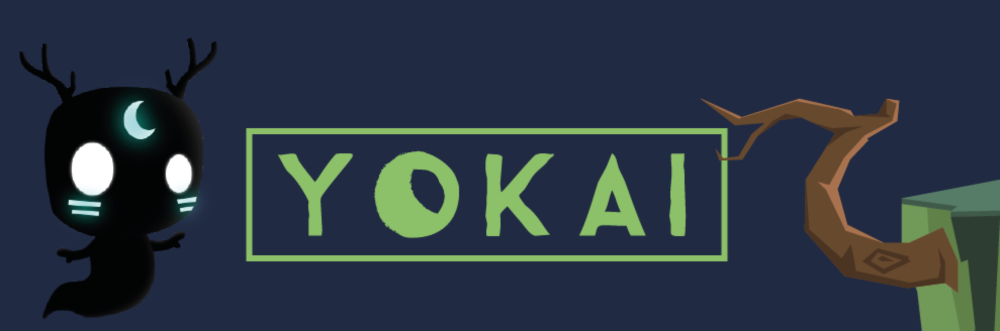
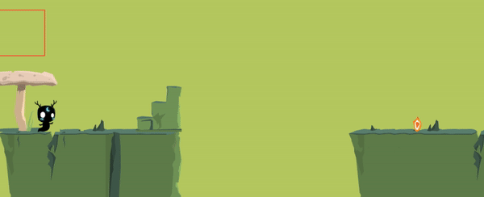

## About

The game is about a tiny ghost living in small but multi-layered fantasy world. The goal is to travel into different areas to gather gems. Unfortunately for our little friend, those gems are scattered into different layers of the world.

Lack of time being a steep obstacle for a rookie dev team like ours, it didn’t allow us to bring as much life as we wanted into our little world (music, sound FX, narration…) , but would it really be a 2017 game without a day one patch and some (free) juicy DLCs ^^

## Dev process

A world can be small but it doesn’t mean it couldn’t be complex. With this idea in sight we decided that we could try to add depth to our tiny world. That’s why we decided to gift a cool power to our little yokai, the ability to travel through different layers of reality. A simple click on the map will make those hidden layers appear and help our little friend in his mission !

All assets have been made during the event.

## Screenshots



## Ludum dare Jam

### Controls

- Move : Arrow keys
- Jump : W
- Aim : Mouse cursor / A, D
- Swith to inner layer : Left mouse button / SpaceBar
- Rollback to previous layer : B key

[PLAY Ludum dare version(Chrome recommended)](https://guillaume-gomez.github.io/LD38/build_v1/)

## Ludum dare post-mortem

### Controls

- Move : A, D //  Q, D
- Jump : W // Z 
- Aim : Arrow keys
- Swith to inner layer : Left mouse button / Spacebar 
- Rollback to previous layer : Shift

[PLAY Post-mortem version(Chrome recommended)](https://guillaume-gomez.github.io/LD38/build/)

## Team
- Leo Delisle : Graphics
- Eloi Calleja: Graphics
- Nans Chabaud: Concept/ Game Design
- Florian Coulouma: Game Design/ Narration
- Guillaume Gomez: Programming
- Maxime Lambert: Concept / Game Design

## Build from sources
```
npm install
npm start
```

go to `localhost:3000` on your browser
